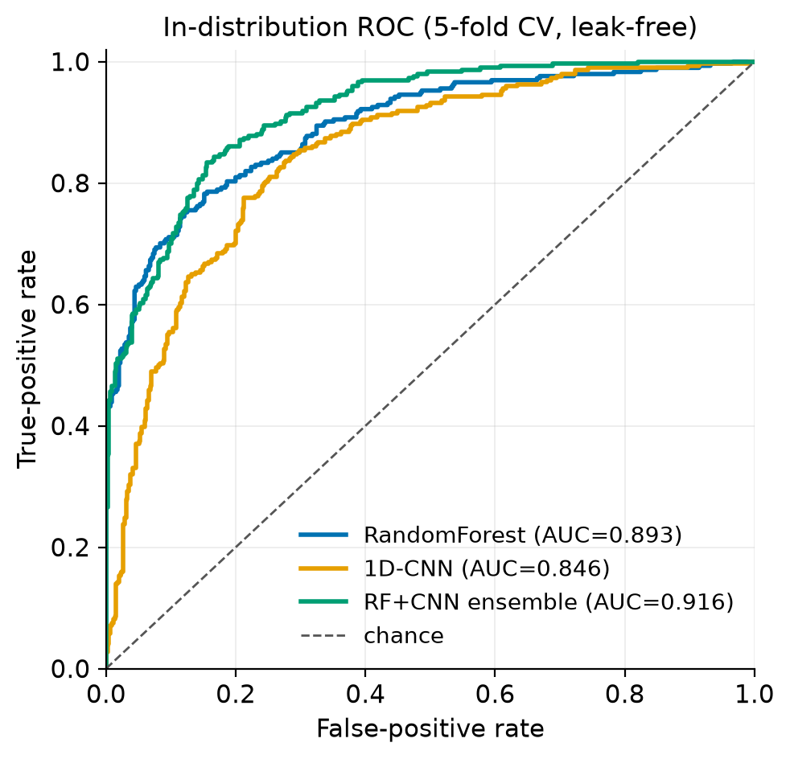
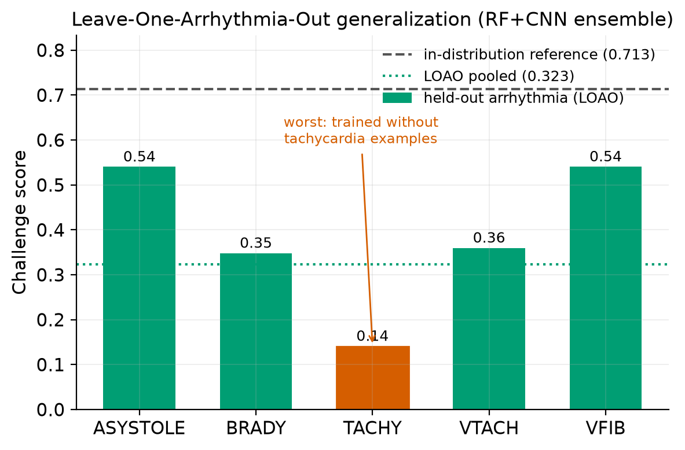
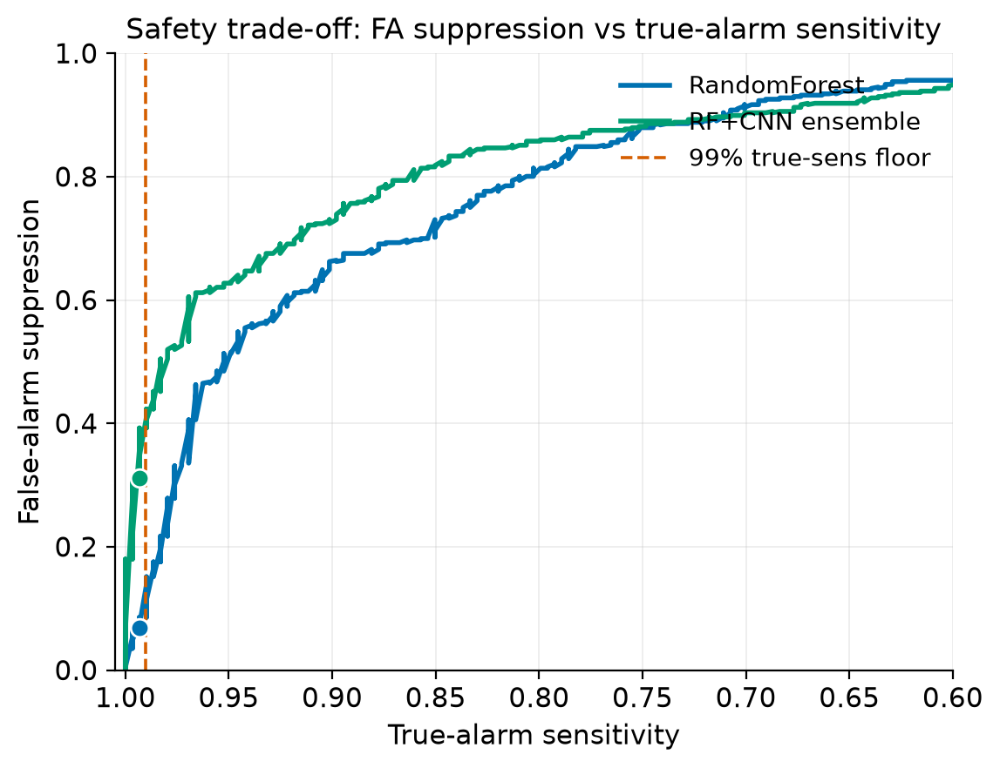
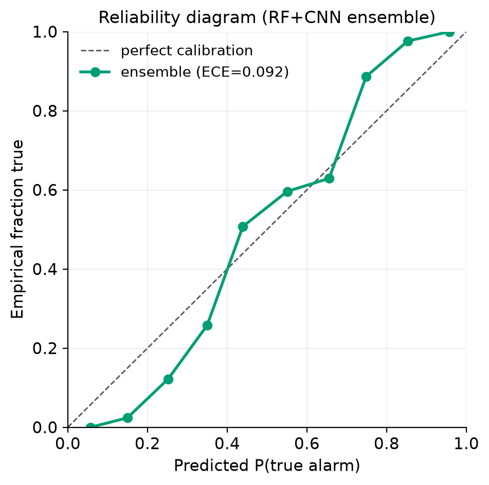
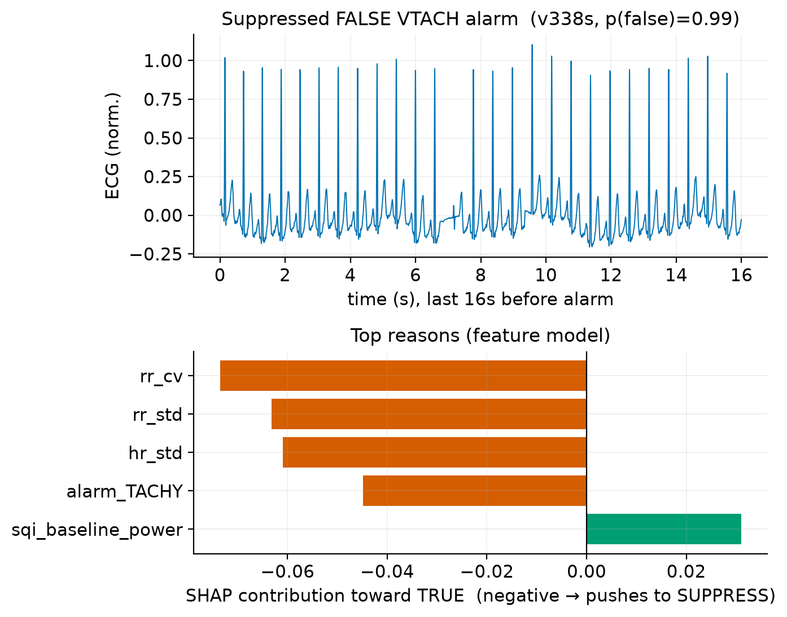

# RESULTS.md — paper-ready results

> Results for **Trustworthy False-Alarm Reduction for ICU Bedside Monitors** on the
> **PhysioNet/CinC 2015** dataset (750 public records; the 500-record test set is unreleased).
> Label 1 = TRUE alarm, 0 = FALSE. Headline metric = challenge score
> `(TP+TN)/(TP+TN+FP+5·FN)`; true-alarm sensitivity co-reported and held at a ≥99% floor.
>
> **Every number below is leak-free and same-protocol:** within each fold (and each held-out
> arrhythmia) both models are trained on a *fit* split, each model's KEEP threshold is selected on
> a *validation* split held out from training, and only then are they scored on the untouched test
> fold. No threshold is ever tuned on the data it is scored on.
>
> Regenerate everything with `python scripts/05_freeze_ensemble.py` (tables) and
> `python scripts/make_figures.py` (figures + per-type CSVs). Sources are named under each table.

---

## A. Tables

### Table 1 — In-distribution performance (5-fold CV on 750 records)
*Source: `data/processed/final_ensemble_results.csv`. Protocol: leak-free 5-fold CV, same for all rows.*

| Model | Challenge score | AUROC | True-alarm sensitivity |
|-------|:---:|:---:|:---:|
| RandomForest (handcrafted features) | 0.641 | 0.893 | 0.898 |
| 1-D CNN (raw waveform) | 0.611 | 0.846 | 0.895 |
| **RF+CNN ensemble (final engine)** | **0.713** | **0.916** | **0.939** |

The equal-weight (0.5/0.5, untuned) ensemble beats either component: deep and classical models are
**complementary** (handcrafted SQI/HR priors vs. raw morphology), lifting AUROC 0.893 → 0.916.
*(For reference, an XGBoost feature-only baseline under the earlier nested-CV protocol scored 0.662 /
AUROC 0.897; `data/processed/baseline_cv_results.csv`.)*

### Table 2 — Leave-One-Arrhythmia-Out generalization (RF+CNN ensemble)
*Source: `data/processed/loao_pertype.csv` (+ in-distribution row from Table 1). Protocol: train on 4
types, test zero-shot on the held-out 5th; physiological features; threshold from the training types only.*

| Held-out type | n (true/false) | Challenge score | True-alarm sens. | AUROC |
|-------|:---:|:---:|:---:|:---:|
| ASYSTOLE | 22 / 100 | 0.540 | 0.409 | 0.817 |
| BRADY | 46 / 43 | 0.348 | 0.500 | 0.850 |
| **TACHY** | 131 / 9 | **0.141** | 0.427 | 0.508 |
| VTACH | 89 / 252 | 0.360 | 0.247 | 0.603 |
| VFIB | 6 / 52 | 0.541 | 0.333 | 0.676 |
| **LOAO pooled** | 750 | **0.323** | 0.381 | 0.654 |
| *In-distribution reference (Table 1)* | *750* | *0.713* | *0.939* | *0.916* |

Generalization to an unseen arrhythmia is far below in-distribution (**0.713 → 0.323 pooled**).
**TACHY generalizes worst** (0.141); ASYSTOLE and VFIB best (~0.54). TACHY's held-out AUROC is at
chance for the ensemble (0.508) and **inverted for the RandomForest alone (0.412 < 0.5;
`loao_pertype.csv`)**: a model never trained on tachycardia inherits a "probably artifact" prior from
the four false-dominated training types and mis-ranks tachy alarms, which are ~93% true.

### Table 3 — Safety operating point at the ≥99% true-alarm sensitivity floor
*Source: `data/processed/safety_detail.csv`. Protocol: thresholds calibrated on each model's leak-free
5-fold out-of-fold probabilities.*

| Model | True-alarm sens. | False-alarm suppression | Defer rate | KEEP-zone precision | ECE | KEEP / SUPPRESS / DEFER |
|-------|:---:|:---:|:---:|:---:|:---:|:---:|
| RandomForest | 0.993 | 0.068 | 0.779 | 0.970 | 0.078 | 133 / 33 / 584 |
| **RF+CNN ensemble** | 0.993 | **0.311** | **0.624** | 0.971 | 0.092 | 138 / 144 / 468 |

At the same ≥99% floor, the ensemble suppresses **~4.6× more false alarms** (6.8% → 31.1%) and
**defers less** (0.779 → 0.624) than the RandomForest, while KEEP-zone precision stays ~0.97 and only
**2 of 294** true alarms are suppressed by either model.

---

## B. Figures

All figures are in `docs/figures/`, generated by `scripts/make_figures.py` from the leak-free
evaluation. Colours: RandomForest = blue, 1-D CNN = orange, ensemble = green.

### Figure 1 — In-distribution ROC (`fig1_roc.png`)

**Caption.** Receiver-operating characteristics for the RandomForest, 1-D CNN, and RF+CNN ensemble
under leak-free 5-fold cross-validation on the 750 public CinC-2015 records. The ensemble attains the
highest area under the curve (AUROC 0.916 vs. 0.893 for RF and 0.846 for the CNN alone).
*Proves:* fusing the handcrafted-feature and raw-waveform models yields a strictly better ranking of
true vs. false alarms — the threshold-independent basis for every downstream gain (E1, E-deep).

### Figure 2 — LOAO generalization (`fig2_loao.png`) — headline figure

**Caption.** Challenge score of the RF+CNN ensemble when each arrhythmia type is held out entirely
from training and tested zero-shot (bars), against the in-distribution reference (dashed) and the LOAO
pooled score (dotted). Every held-out type falls far below in-distribution; **tachycardia is worst**
(0.141), because the four training types are false-alarm-dominated and the model never learns that
high-rate alarms are usually real.
*Proves (C1, headline):* the model does **not** generalize to arrhythmia patterns it never trained on —
the core deployability limitation and the argument that a new monitor/population needs local validation.

### Figure 3 — Safety trade-off (`fig3_safety.png`)

**Caption.** False-alarm suppression versus true-alarm sensitivity as the SUPPRESS threshold is swept,
for the RandomForest and the ensemble (dots = the calibrated operating points; dashed line = the 99%
sensitivity floor; x-axis oriented so the safe, high-sensitivity side is on the left). At the floor the
ensemble curve sits well above the RandomForest — suppressing 31.1% vs. 6.8% of false alarms.
*Proves (C2):* a better AUROC converts directly into more false-alarm suppression at the same safety
guarantee — the answer to "can we defer less without silencing real emergencies?" is yes, via the ensemble.

### Figure 4 — Calibration / reliability (`fig4_calibration.png`)

**Caption.** Reliability diagram for the ensemble's out-of-fold P(true alarm): predicted probability
(x) vs. empirical fraction of true alarms (y), against perfect calibration (dashed). Expected
Calibration Error = 0.092.
*Proves (C3/C4):* the ensemble's probabilities are reasonably calibrated, so the confidence shown to a
nurse and the safety thresholds mean what they say; residual miscalibration (ECE ≈ 0.09) is an honest
target for post-hoc recalibration.

### Figure 5 — Example explanation (`fig5_explanation.png`)

**Caption.** A correctly-suppressed **false** ventricular-tachycardia alarm (record `v338s`,
p(false) = 0.99): the last 16 s of ECG (top) and the top SHAP reasons from the feature model (bottom;
negative = pushes toward SUPPRESS). Low rhythm variability (`rr_cv`, `rr_std`, `hr_std`) drives the
suppression — the rhythm is too regular to be true VT.
*Proves (C3):* per-alarm explanations are clinically plausible and align with signal-quality / rhythm
features, supporting the trust layer.

---

## C. What these results support (mapping to contributions)

- **E1 — we reproduce the benchmark, and the ensemble is our engine.** *Table 1, Figure 1.* The RF+CNN
  ensemble reaches challenge score 0.713 / AUROC 0.916 in-distribution at 0.939 true-alarm sensitivity.
- **E-deep — deep learning adds complementary signal.** *Table 1, Figure 1.* The CNN loses to the RF
  alone on 750 records but lifts the ensemble above both — deep models are best used as a fused view,
  not a standalone replacement.
- **C1 — generalization under distribution shift (headline).** *Table 2, Figure 2.* Leave-One-Arrhythmia-Out
  quantifies a large, honest gap (0.713 → 0.323 pooled), with tachycardia the worst and its ranking
  inverted for the RF — evidence that deployment on unseen patterns is unsafe without local validation.
  (LOSO / cross-hospital is not testable here — no source tags — and is future work.)
- **C2 — adaptive, safety-constrained triage.** *Table 3, Figure 3.* At a ≥99% true-alarm sensitivity
  floor the ensemble suppresses ~4.6× more false alarms and defers less than the RandomForest, showing
  the AUROC gain buys real workload relief without sacrificing safety.
- **C3 — trust layer.** *Figure 4 (calibration), Figure 5 (explanation).* Calibrated probabilities
  (ECE ≈ 0.09) plus plausible per-alarm SHAP reasons make each verdict interrogable.
- **C4 — rigor.** *All tables.* Same-protocol, leak-free evaluation (threshold on a held-out validation
  split, never the scored fold); no test-set tuning; calibration reported; single-dataset scope and the
  hidden test set stated plainly.

### Open / TODO (not fabricated)
- **Latency–sensitivity curve (E4):** `choose_latency()` exists, but the per-alarm latency figure needs a
  streaming model that re-scores over a growing window — not yet built. Marked TODO rather than estimated.
- **Cross-hospital (LOSO) and few-shot local calibration:** require a second, source-tagged dataset — future work.
- **Waveform/attention explanation:** the attention CNN-LSTM exposes weights, but a saliency figure over
  the raw waveform is not yet produced (Figure 5 uses feature-model SHAP).
